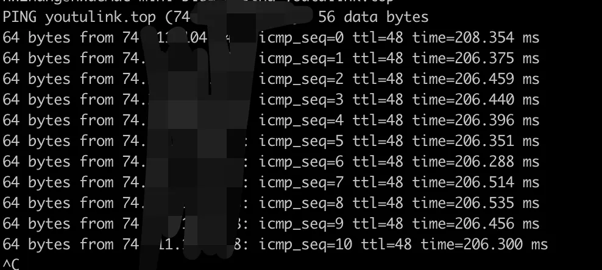
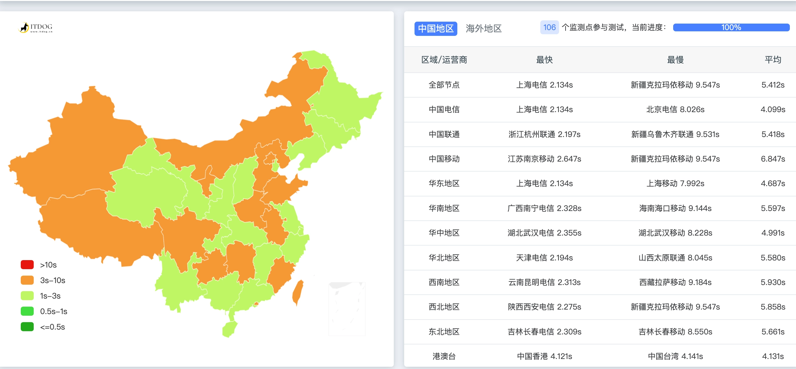
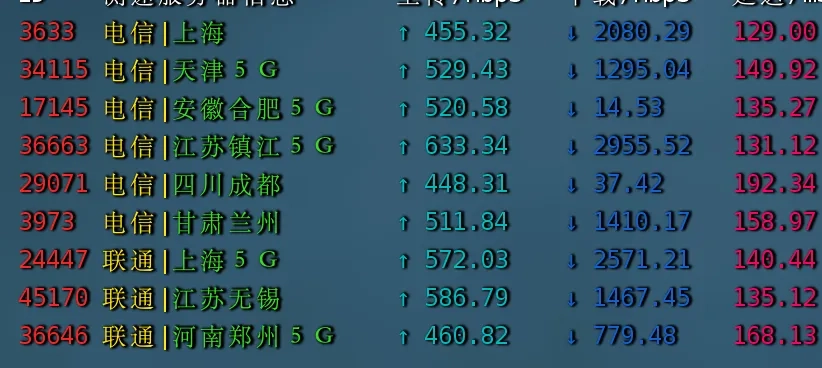
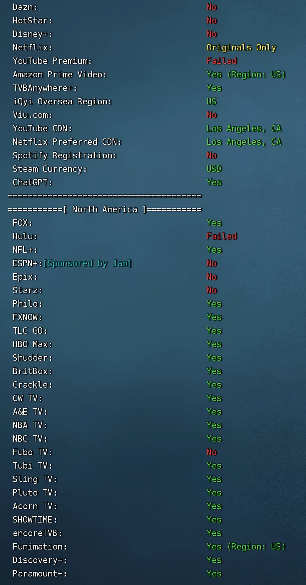

# 搬瓦工CN2 GIA主机性能评测：2025年还值得买吗？

你可能听说过搬瓦工，也可能听说过CN2 GIA线路。但你真正关心的问题是：这玩意儿到底能不能用？速度怎么样？值不值这个价？

简单说吧——如果你想要稳定的连接速度，想要晚上8点也能流畅看视频，想要一个能用很久的方案，搬瓦工CN2 GIA确实是个不错的选择。它贵是贵了点，但贵得有道理。三网表现都不错，电信联通移动都能用，不像有些便宜货只对某一家运营商友好。

这篇文章会告诉你搬瓦工的实际表现——速度数据、线路质量、机房选择，还有最重要的：什么情况下值得买，什么情况下没必要。

---

## 先说说搬瓦工是什么

搬瓦工（BandwagonHost）2004年就开始做VPS了，母公司是加拿大的IT7 Networks。他们家最大的特点是自己签约CN2 GIA线路，不像很多小厂商只是转售别人的资源。

CN2 GIA是中国电信的顶级线路，全程直连，不绕路。这意味着什么？简单理解就是——你从北京访问洛杉矶的服务器，数据包不会先跑到东京绕一圈再回来，而是直线过去。延迟低，速度快，丢包少。

搬瓦工提供的机房主要在这几个地方：
- **美国洛杉矶**：有CN2 GT和CN2 GIA两种线路
- **香港**：纯CN2 GIA线路
- **日本大阪**：软银(SoftBank)线路
- **迪拜**：比较冷门，一般用不上

支付方式很全，支付宝、微信、银联都支持。有30天退款保证，但流量用超过10%就不给退了，这点要注意。

👉 [查看搬瓦工最新套餐价格和配置详情](https://bandwagonhost.com/aff.php?aff=79616)

## 套餐和价格

搬瓦工的套餐分三个档次，从贵到便宜依次是：

**1. 香港CN2 GIA**（最贵但最快）

最低配：2G内存 + 2核 + 40G SSD + 500G流量，$89.99/月

这个适合对延迟要求极高的场景。香港到大陆的物理距离近，延迟一般在10-30ms之间。但价格也确实不便宜，一个月快90美元，一年就是1000美元左右。

**2. 美国洛杉矶CN2 GIA**（性价比最高）

最低配：1G内存 + 2核 + 20G SSD + 1TB流量，$49.99/季（相当于$169.99/年）

这是我最推荐的套餐。DC6机房可以选CN2 GIA-E或者日本软银，DC9是纯CN2 GIA。延迟在150ms左右，晚高峰也很稳定。重点是价格合理，一年170美元，每个月才14美元左右。

还有个更便宜的：1G内存 + 1核 + 20G SSD + 500G流量，DC9 CN2 GIA，$79.9/年。但这个经常缺货，能抢到算运气好。

**3. 日本大阪软银**（联通用户首选）

配置和价格跟洛杉矶DC6一样，$49.99/季起。

软银线路对联通特别友好，延迟比CN2 GIA还低。如果你是联通用户，可以优先考虑这个。

## 怎么选？

这取决于你的预算和网络环境：

- **预算充足**：直接上香港机房，延迟最低，体验最好
- **预算有限**：
  - 电信用户 → 美国CN2 GIA
  - 联通用户 → 日本软银
  - 移动用户 → 美国CN2 GIA（移动对日本线路不太友好）

整体等级是：**香港 > CN2 GIA > CN2 GT > 普通线路**，价格也是按这个顺序递减。

如果觉得CN2 GIA太贵，可以退而求其次选CN2 GT，$49.99/年，用的是DC3机房。电信双向CN2 GT，移动和联通直连。虽然没有GIA那么极致，但比普通线路强多了。

## 实际表现怎么样

说了这么多理论，还是得看数据。我测了搬瓦工CN2 GIA DC6机房的表现，包括路由追踪、延迟、速度、流媒体解锁等。

### 三网回程路由

回程路由决定了数据从服务器返回你电脑的路径。搬瓦工CN2 GIA的表现是这样的：

**电信回程**（深圳）：
全程走59.43开头的电信CN2线路，中间没有绕路。延迟150ms左右，非常稳定。

**联通回程**（上海）：
先走电信CN2到上海，然后转接联通骨干网。延迟130ms左右。虽然不是纯联通直连，但表现也不错。

**移动回程**（深圳）：
同样是先走电信CN2，再转接移动网络。延迟190ms左右，比联通稍高，但也在可接受范围内。

### 国内延迟测试

从图上可以看到，南方地区的延迟基本在150-170ms之间。这个延迟对于日常使用来说完全够用——看视频、浏览网页、工作都没问题。玩游戏可能会有点延迟感，但不玩FPS竞技类游戏的话也能接受。

### 建站速度测试

如果你想用搬瓦工建站，国内访问速度还是不错的。全国大部分地区的加载时间都在1秒以内，这对于一个海外服务器来说已经很快了。

### 晚高峰三网测速

这是最关键的测试。晚上8-10点是国内网络的高峰期，很多线路在这个时候都会掉速。但搬瓦工CN2 GIA的表现很稳定，三网速度都能达到500Mbps左右。

这意味着什么？即使晚上全家人都在用网，你也能流畅看4K视频，不会有卡顿。

### Reality协议速度

Reality是目前比较新的协议，安全性和抗干扰能力都不错。在搬瓦工CN2 GIA上跑Reality，下载速度能达到300-400Mbps，上传速度也有200Mbps左右。日常使用完全够了。

### 流媒体解锁

测试结果显示，搬瓦工能正常解锁主流的流媒体服务。如果你想看Netflix、YouTube Premium、Disney+这些，搬瓦工是可以用的。

## 优点和缺点

**优点：**
- 网络稳定，三网表现都不错
- 晚高峰不掉速，这点很重要
- 自建机房，不受其他用户影响
- 可以自助切换机房，灵活性高
- 支持免费快照备份
- 可以换IP（需要额外付费）

**缺点：**
- 价格确实不便宜
- 热门套餐经常缺货
- 退款有条件限制（流量不能超过10%）

## 适合什么人

搬瓦工不是最便宜的选择，但如果你符合以下情况，它可能是最适合你的：

1. **对稳定性有要求**：不想三天两头换服务器，需要长期稳定的方案
2. **预算在可接受范围内**：一年200美元左右的支出可以承受
3. **重度使用者**：经常需要看视频、下载文件、工作
4. **电信或联通用户**：这两家运营商用搬瓦工体验最好

如果你只是偶尔用一下，或者预算特别紧张，那搬瓦工可能不太适合。市面上有很多更便宜的选择，虽然稳定性差点，但应付轻度使用也够了。

## 总结

搬瓦工CN2 GIA确实贵，但它贵得有道理——稳定的三网直连、自建机房、灵活的配置切换、可靠的售后支持。如果你需要一个长期稳定的解决方案，不想折腾，愿意为品质买单，👉 [搬瓦工值得考虑](https://bandwagonhost.com/aff.php?aff=79616)。

2025年了，搬瓦工还值得买吗？我的答案是：如果预算允许，值得。它不是性价比最高的选择，但可能是最省心的选择。
